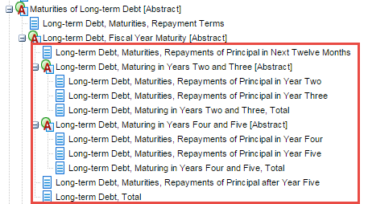
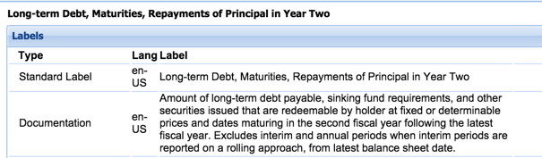

# Context Dates After Period End Date
Rule ID: DQC_0005   
Status: Final  
Release date: November 19, 2015  
Effective date: January 1, 2016 
Latest Committee-approved update: May 17, 2016 (see rule appendix for details)

## Rule function

This rule tests that the use of dates associated with subsequent events, forecasts and the element **Entity Common Stock, Shares Outstanding** are appropriate.

**Entity Common Stock, Shares Outstanding**

When a value is reported for the element **Entity Common Stock, Shares Outstanding** the date associated with this value must be on or after the reporting period end date. If the date associated with the value for **Entity Common Stock, Shares Outstanding** is earlier than the reporting period end date then an error will be reported. (DQC_0005.17)

**Subsequent events**

When a value is reported for a fact which is indicated in the filing  as a subsequent event the date associated with this value must be after the reporting period end date. If the date associated with this fact value is on or earlier than the reporting period end date, then an error will be reported. (Note: Fact values are indicated as being subsequent events in XBRL files by using the  Subsequent Event Type [Axis] as a dimension of the fact in an XBRL instance.) (DQC_0005.48)

**Forecasts**

When a value is reported for a fact which is indicated in the filing as a forecast  the date or end date of a date range associated with this value must be after the reporting period end date. If the date or end date of a date range associated with this fact value is on or earlier than the reporting period end date then an error will be reported. (Note: Fact values are indicated as being forecasts in the XBRL file by using the Statement Scenario [Axis] and Scenario Forecast [Member] as dimensions of the fact in an XBRL instance.)
(DQC_0005.49)

**Form exclusions**

The rule does not run on Forms S-1 and S-11. These forms often combine multiple XBRL filings for earlier reporting periods. If the earlier reporting period includes a subsequent event disclosure, running the rule would incorrectly show the dates of the subsequent event as an error. 

## Authoritative reference
EDGAR Filer Manual 6.5.21, the date used for the Document and Entity Information element **Entity Common Stock, Shares Outstanding** must be the measurement date reported on the cover page of the HTML document and the values for this element should be the same as the amount reported on the cover page. The element, **Entity Common Stock, Shares Outstanding** should have a date no earlier than the end of the reporting period.

Subsequent events are defined as "Events or transactions that occur after the balance sheet date but before financial statements are issued or available to be issued". ASC 855-10-20

## Guidance

**Common Stock Shares Outstanding**

* The element **Common Stock Shares Outstanding** is used for concepts on the balance sheet,  statement of shareholders' equity or disclosures within footnotes. The context date used for this element must be the current or prior reporting period.

* The element **Entity Common Stock, Shares Outstanding** is used for disclosures on the cover page of the filing. The context date used for this element is a date on or after the reporting period.

**Subsequent events**

These disclosures have context dates after the reporting period to accurately identify the time frame of the transaction. These disclosures will use the Subsequent Event Type Axis along with the line item concept.  

**Forecasts**

For projections or forecasts, dates are based on the projection/forecast dates. These disclosures will use the Scenario Axis and the Scenario, Forecast Member along with the line item concept.

Not all transactions reported or forecast for a future period will require a date that is after the current reporting period.  The date used is based on the definition of the concept used, specifically whether the definition incorporates a future period.  For example, concepts like **Long-term Debt, Maturities, Repayments of Principal in Next Twelve Months**, or **Long-term Debt, Maturities, Repayments of Principal in Year Two** incorporate future periods in their definitions. Dates after the reporting period should not be used with elements that incorporate future periods in their definitions.

Example of elements and definitions that incorporate a future period:

## Problem solved by the rule

Filers apply incorrect reporting dates to elements. This error impacts the consumption of the elements because users will extract the data based on the expected reporting date.  For example, using an incorrect date for public float will result in an incorrect calculation of share value because the correct element will not be extracted into the analysis if the reporting date is not applied correctly. 

## Example rule message 
(Note: Presentation style of rule messages may differ among software implementations of the rules.) 

**DQC_0005.17**

The date of 2014-11-30 used for Entity Common Stock Shares Outstanding with a value of 100,000 is earlier than the reporting period end date 2014-12-31. Update the date used for Entity Common Stock Shares Outstanding to be the same as the cover sheet of the filing.   
The properties of this dei:EntityCommonStockSharesOutstanding fact are:   
Period: 2014-11-30  
Dimensions: none  
Unit: none  
Rule version: 1.0  

**DQC_0005.48**

The date of 2014-12-31 used for Loss Contingency Accrual, Product Liability, Net and the Subsequent Event Type [Axis] with a value of 100,000 is earlier than or the same as the reporting period end date of 2014-12-31. Either remove the subsequent event axis from this value, change the end date for the value or update the Document and Entity Information document period end date.   
The properties of this us-gaap:LossContingencyAccrualProductLiabilityNet fact are:   
Period: 2014-01-01 to 2014-12-31   
Dimensions: SubsequentEventTypeAxis=SubsequentEventMember   
Unit: USD   
Rule version: 1.0

**DQC_0005.49**

The date of 2014-12-31 used for Revenues and the Statement Scenario [Axis] and Scenario Forecast [Member] with a value of 500,000,000 is earlier than or the same as the reporting period end date of 2014-12-31. Either remove the statement scenario axis and forecast member from this value, change the end date for the value or update the Document and Entity Information document period end date. 
The properties of this us-gaap:Revenues fact are:   
Period: 2014-01-01 to 2014-12-31   
Dimensions: StatementScenerioAxis=ScenarioForecastMember   
Unit: USD   
Rule version: 1.0   

## For Developers

The Global Rule Logic document contains general guidelines for implementation of rules.

The rule message template contains text and parametric reference to arguments of the rule operation, using the syntax ${parameter} to indicate that insertion of a parameter's value is to occur. 

### Message template

**DQC_0005.17**

The date of ${fact1.period} used for ${fact1.label} with a value of ${fact1.value} is earlier than the reporting period end date ${dei:DocumentPeriodEndDate.fact.value}. Update the date used for ${fact1.label} to be the same as the cover sheet of the filing.   
The properties of this ${fact1.name} fact are:   
Period: ${fact1.period}   
Dimensions: ${fact1.dimensions}   
Unit: ${fact1.unit}   
Rule version: ${ruleVersion}

**DQC_0005.48** 

The date of ${fact1.period.endDate} used for ${fact1.label} and the ${us-gaap:SubsequentEventTypeAxis.label} with a value of ${fact1.value} is earlier than or the same as the reporting period end date of ${dei:DocumentPeriodEndDate.fact.value}. Either remove the subsequent event axis from this value, change the end date for the value or update the Document and Entity Information document period end date.   
The properties of this ${fact1.name} fact are:   
Period: ${fact1.period}   
Dimensions: ${fact1.dimensions}   
Unit: ${fact1.unit}   
Rule version: ${ruleVersion}

**DQC_0005.49**

The date of ${fact1.period.endDate} used for ${fact1.label} and the ${us-gaap:StatementScenarioAxis.label} and ${us-gaap:ScenarioForecastMember.label} with a value of ${fact1.value} is earlier than or the same as the reporting period end date of ${dei:DocumentPeriodEndDate.fact.value}. Either remove the statement scenario axis and forecast member from this value, change the end date for the value or update the Document and Entity Information document period end date.   
The properties of this ${fact1.name} are:   
Period: ${fact1.period}   
Dimensions: ${fact1.dimensions}   
Unit: ${fact1.unit}   
Rule version: ${ruleVersion}

### Rule element ID index

The rule element id is used to identify unique elements or combinations of elements tested in the rule.  

| Rule element ID | Element label | Element name |
| ----- | ----- | ----- |
| DQC_0005.17 | Entity Common Stock, Shares Outstanding | EntityCommonStockSharesOutstanding |
| DQC_0005.48 | Subsequent Event Type [Axis] | SubsequentEventTypeAxis |
| DQC_0005.49 | Statement Scenario [Axis] and Scenario Forecast [Member] | StatementScenarioAxis and ScenarioForecastMember |

## **Appendix A**

### Exclusions from the rule:

*   Form S-1 and S-11 exclusions (effective May 17, 2016)

© Copyright 2015 - 2016, XBRL US Inc. All rights reserved.   
See [License](../../License.md) for license information.  
See [Patent Notice](../../PatentNotice.md) for patent infringement notice.
