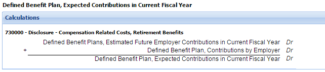

# Element A must be less than or equal to Element B
Rule ID: DQC_0009   
Status: Final   
Release date: November 19, 2015  
Effective date: January 1, 2016

## Rule function

This rule tests that the fact value for certain elements are less than or equal to the fact value of other elements.

XBRL facts reported are expected to follow accounting logic. Consequently, certain reported values are expected to have a mathematical relationship to other reported values.

Example - The value reported for the element **Common Stock, Shares, Outstanding is** expected to be less than or equal to the value reported for the element **Common Stock, Shares, Issued**, which in turn are expected to be less than or equal to the values reported for the element **Common Stock, Shares Authorized**. This is because shares must be authorized before they can be issued, and before they become outstanding. 

Example - The element **Undistributed Earnings of Foreign Subsidiaries** is used for the amount of foreign earnings permanently reinvested outside the country of domicile. The related deferred tax liability value, tagged with the element **Deferred Tax Liability Not Recognized, Amount of Unrecognized Deferred Tax Liability, Undistributed Earnings of Foreign Subsidiaries** should be less than or equal to the value reported for the element **Undistributed Earnings of Foreign Subsidiaries**. 

Example - The value reported for the element **Defined Benefit Plans, Estimated Future Employer Contributions in Current Fiscal Year** should be less than or equal to the value reported for the element **Defined Benefit Plan, Expected Contributions in Current Fiscal Year**, which represents the total of actual contributions and estimated future contributions for the fiscal period.   

  

Example - The element **Defined Benefit Plan, Accumulated Benefit Obligation** differs from the element **Defined Benefit Plan, Benefit Obligation** in that the definition for the accumulated benefit obligation includes no assumption about future compensation levels.  For plans with flat-benefit or nonpay-related pension benefit formulas, the values for accumulated benefit obligation and projected benefit obligation are the same.  Based on this accounting difference it is expected that the value for the element **Defined Benefit Plan, Accumulated Benefit Obligation** would always be less than or equal to the value being reported for the element **Defined Benefit Plan, Benefit Obligation**. 

Example - The value reported for the element **Defined Benefit Plan, Pension Plans with Accumulated Benefit Obligations in Excess of Plan Assets, Aggregate Projected Benefit Obligation** must be less than or equal to the value reported for the element of **Defined Benefit Plan, Accumulated Benefit Obligation (ABO)** because the ABO of the first element is a portion of the aggregate ABO amount of the second amount. 

See file [DQC_0009_ListOfElements](DQC_0009_ListOfElements.xlsx?raw=true) for the elements tested by this rule. Elements are listed in order by the most commonly occurring errors.

## Problem solved by the rule

Filers incorrectly select elements and report incorrect values for certain elements.  This is a problem for consumption because the data for the element will be extracted incorrectly for analysis.  These rules can detect inappropriate element selection and incorrect values  by comparing the values among pairs of elements that should have specific relationships. For example, some filers incorrectly use the element for unrepatriated foreign earnings instead of the element for the deferred tax liability on unrepatriated foreign earnings. This rule can detect the error by ensuring that the tagged value for unrepatriated foreign earnings is greater than the tagged value for the associated tax liability on those earnings.  

## Example rule message 
(Note: Presentation style of rule messages may differ among software implementations of the rules.)

An example of the general rule message is shown below. Appendix A details specific rule messages for certain combinations of elements. If a message is not defined for a specific set of elements, the general rule message is used.  

### General rule message example

The value of common stock shares outstanding, 500,000, should be less than or equal to common shares authorized, 400,000.   
The properties of this us-gaap:CommonStockSharesOutstanding fact are:   
Period: 2014-12-31   
Dimensions: Class Of Stock Axis=Common Stock A Member   
Unit: shares   
Rule version: 1.0

## For Developers

The Global Rule Logic document contains general guidelines for implementation of rules.

The rule message template contains text and parametric reference to arguments of the rule operation, using the syntax ${parameter} to indicate that insertion of a parameter's value is to occur. 

### General message template

The value of ${fact1.label}, ${fact1.value}, should be less than or equal to ${fact2.label}, ${fact2.value}.   
The properties of this ${fact1.name} fact are:   
Period: ${fact1.period}   
Dimensions: ${fact1.dimensions}   
Unit: ${fact1.unit}   
Rule version: ${ruleVersion}

### Rule element ID index

The rule element id is used to identify unique elements or combinations of elements tested in the rule.

| Rule element ID | Element label (fact1) (Lesser) | Element  name 1 (fact1) | Element label (fact2) (Greater) | Element name (fact2) |
| ----- | ----- | ----- | ----- | ----- |
| DQC_0009.15 | Common Stock, Shares, Outstanding | CommonStockSharesOutstanding | Common Stock, Shares Authorized | CommonStockSharesAuthorized | 
| DQC_0009.19 | Preferred Stock, Shares Outstanding | PreferredStockSharesOutstanding | Preferred Stock, Shares Issued | PreferredStockSharesIssued |
| DQC_0009.21 | Common Stock, Shares, Issued | CommonStockSharesIssued | Common Stock, Shares Authorized | CommonStockSharesAuthorized |
| DQC_0009.22 | Preferred Stock, Shares Issued | PreferredStockSharesIssued | Preferred Stock, Shares Authorized | PreferredStockSharesAuthorized |
| DQC_0009.23 | Preferred Stock, Shares Outstanding | PreferredStockSharesOutstanding | Preferred Stock, Shares Authorized | PreferredStockSharesAuthorized |
| DQC_0009.24 | Common Stock, Shares, Outstanding | CommonStockSharesOutstanding | Common Stock, Shares, Issued | CommonStockSharesIssued |
| DQC_0009.47 | Deferred Tax Liability Not Recognized, Amount of Unrecognized Deferred Tax Liability, Undistributed Earnings of Foreign Subsidiaries | DeferredTaxLiabilityNotRecognizedAmountOfUnrecognizedDeferredTaxLiabilityUndistributedEarningsOfForeignSubsidiaries | Undistributed Earnings of Foreign Subsidiaries | UndistributedEarningsOfForeignSubsidiaries |
| Pension Comparison Tests |
| DQC_0009.39 | Defined Benefit Plan, Plans with Benefit Obligations in Excess of Plan Assets, Aggregate Benefit Obligation | DefinedBenefitPlanPlansWithBenefitObligationsInExcessOfPlanAssetsAggregateBenefitObligation | Defined Benefit Plan, Benefit Obligation | DefinedBenefitPlanBenefitObligation | 
| DQC_0009.40 | Defined Benefit Plan, Pension Plans with Accumulated Benefit Obligations in Excess of Plan Assets, Aggregate Accumulated Benefit Obligation | DefinedBenefitPlanPensionPlansWithAccumulatedBenefitObligationsInExcessOfPlanAssetsAggregateAccumulatedBenefitObligation
 | Defined Benefit Plan, Accumulated Benefit Obligation | DefinedBenefitPlanAccumulatedBenefitObligation | 
| DQC_0009.41 | Defined Benefit Plan, Pension Plans with Accumulated Benefit Obligations in Excess of Plan Assets, Aggregate Fair Value of Plan Assets | DefinedBenefitPlanPensionPlansWithAccumulatedBenefitObligationsInExcessOfPlanAssetsAggregateFairValueOfPlanAssets | Defined Benefit Plan, Fair Value of Plan Assets | DefinedBenefitPlanFairValueOfPlanAssets | 
| DQC_0009.42 | Defined Benefit Plan, Pension Plans with Accumulated Benefit Obligations in Excess of Plan Assets, Aggregate Projected Benefit Obligation | DefinedBenefitPlanPensionPlansWithAccumulatedBenefitObligationsInExcessOfPlanAssetsAggregateProjectedBenefitObligation | Defined Benefit Plan, Benefit Obligation | DefinedBenefitPlanBenefitObligation |
| DQC_0009.45 | Defined Benefit Plan, Expected Contributions in Current Fiscal Year | DefinedBenefitPlansEstimatedFutureEmployerContributionsInCurrentFiscalYear | efined Benefit Plan, Expected Contributions in Current Fiscal Year | DefinedBenefitPlanExpectedContributionsInCurrentFiscalYear |
| DQC_0009.46 | Defined Benefit Plan, Accumulated Benefit Obligation | DefinedBenefitPlanAccumulatedBenefitObligation | Defined Benefit Plan, Benefit Obligation | DefinedBenefitPlanBenefitObligation |

## Appendix A - Specific rule messages

### DQC_0009.15

Use the general message.

### DQC_0009.19

Use the general message.

### DQC_0009.21

Use the general message.

### DQC_0009.22

Use the general message.

### DQC_0009.23

Use the general message.

### DQC_0009.24

Use the general message.

### DQC_0009.39

The value of ${fact1.label}, ${fact1.value}, should be less than or equal to ${fact2.label}, ${fact2.value}. ${fact1.label} is a subset of ${fact2.label}.   
The properties of this ${fact1.name} fact are:   
Period: ${fact1.period}   
Dimensions: ${fact1.dimensions}   
Unit: ${fact1.unit}   
Rule version: ${ruleVersion}

### DQC_0009.40

The value of ${fact1.label}, ${fact1.value}, should be less than or equal to ${fact2.label}, ${fact2.value}. ${fact1.label} is a subset of ${fact2.label}.   
The properties of this ${fact1.name} fact are:   
Period: ${fact1.period}   
Dimensions: ${fact1.dimensions}   
Unit: ${fact1.unit}   
Rule version: ${ruleVersion}

### DQC_0009.41

The value of ${fact1.label}, ${fact1.value}, should be less than or equal to ${fact2.label}, ${fact2.value}. ${fact1.label} is a subset of ${fact2.label}.     
The properties of this ${fact1.name} fact are:   
Period: ${fact1.period}   
Dimensions: ${fact1.dimensions}   
Unit: ${fact1.unit}   
Rule version: ${ruleVersion}

### DQC_0009.42

The value of ${fact1.label}, ${fact1.value}, should be less than or equal to ${fact2.label}, ${fact2.value}. ${fact1.label} is a subset of ${fact2.label}.      
The properties of this $(fact1.name} fact are:   
Period: ${fact1.period}   
Dimensions: ${fact1.dimensions}   
Unit: ${fact1.unit}   
Rule version: ${ruleVersion}

### DQC_0009.45

The value of ${fact1.label}, ${fact1.value}, should be less than or equal to ${fact2.label}, ${fact2.value}. The value of the remaining contribution for the year should be less than or equal to the expected contributions for the entire year.    
The properties of this ${fact1.name} fact are:   
Period: ${fact1.period}   
Dimensions: ${fact1.dimensions}   
Unit: ${fact1.unit}   
Rule version: ${ruleVersion}

### DQC_0009.46

The value of ${fact1.label}, ${fact1.value}, should be less than or equal to ${fact2.label}, ${fact2.value}.  ${fact1.label} must be less than or equal to ${fact2.label}, as it does not include assumptions about future compensation levels.    
The properties of this ${fact1.name} fact are:   
Period: ${fact1.period}   
Dimensions: ${fact1.dimensions}   
Unit: ${fact1.unit}   
Rule version: ${ruleVersion}

### DQC_0009.47

Use the general message.

© Copyright 2015 - 2016, XBRL US Inc. All rights reserved.   
See [License](../../License.md) for license information.  
See [Patent Notice](../../PatentNotice.md) for patent infringement notice.
